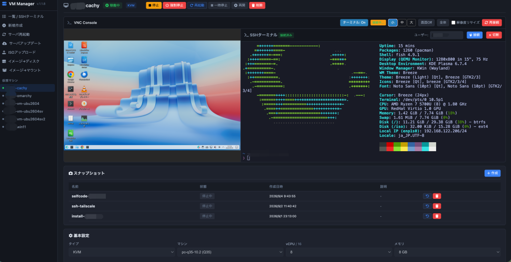

# VM Manager

libvirt / QEMU 上の仮想マシンを Web ブラウザから管理するための Web UI です。

## 概要

- Python (Flask) + libvirt ベースの Web アプリケーション
- systemd サービス (`vm-manage`) として動作
- [Tailscale serve](https://tailscale.com) により HTTPS 化し、**Tailnet 内からのみ**アクセス可能
- アプリは `127.0.0.1:8090` のみで待ち受けるため、**LAN からは直接アクセス不可**



## インストール方法

インストールスクリプトを GitHub からダウンロードして、root で実行します。
Debian/Ubuntu と Arch/CachyOS を自動判別し、パッケージ管理 (`apt` / `pacman`) を使い分けます。

```bash
curl -fsSL -o /tmp/install-vmmanager.sh \
  https://raw.githubusercontent.com/hirogura/vmmanager/main/install-vmmanager.sh
chmod +x /tmp/install-vmmanager.sh
sudo /tmp/install-vmmanager.sh
```

※ 旧スクリプト名 (`install-vmmanager1.sh`) でも実行できます（統合スクリプトへ転送されます）。

### 対応ディストリビューション

- Debian / Ubuntu 系 (`apt` を使用)
- Arch / CachyOS 系 (`pacman` を使用。`edk2-ovmf` / `swtpm` / `dnsmasq` 等の Arch パッケージ名に対応)

アプリ本体 (`app.py`) も実行時に OS 差異を自動吸収します（`/etc/os-release` による判別 + 実在ファイルの検出）:

- OVMF パス: Debian (`/usr/share/OVMF/OVMF_CODE_4M*.fd`) と Arch (`/usr/share/edk2/x64/OVMF_CODE*.4m.fd`) の両方から実在ファイルを検出
- Secure Boot: `secure-boot` のみ要求し `enrolled-keys=yes` は付けない（CachyOS/Arch のファームウェア記述子に `enrolled-keys` が無く define 失敗するため。Debian/Ubuntu でも同一テンプレートが選ばれる）。`<smm state='on'/>` を自動付与し、Q35系以外のマシンタイプでは作成・編集時にエラーを返す。旧形式の定義は起動時に自動修復する。CachyOS/Arch の VARS テンプレートは鍵未登録（空ストア）のため、SB 要求時は `virt-fw-vars`（`virt-firmware` パッケージ）で VM ごとの NVRAM へ鍵登録する（MS 証明書 2011+2023 世代を内包・VM 固有 PK を自動生成。生成 PK の秘密鍵は保持されない）。自前実装（v1.6.0）では db のベンダーGUID を誤っており MS 署名ブートローダが起動できなかったため v1.6.1 で参照実装に委譲した。未登録の既存 VM は詳細画面に「鍵未登録のため未実施」と表示し、編集保存で登録される
- `<seclabel model='apparmor'>`: AppArmor が有効なホストでのみ付与（CachyOS では省略し libvirt の自動付与に任せる）
- ボリュームの所有者: `libvirt-qemu:kvm` → `libvirt-qemu:libvirt` → `qemu:kvm` → `root:kvm` の順にフォールバック
- noVNC / websockify: `/usr/share/novnc`・`/usr/share/webapps/novnc`・`PATH` 上の `websockify` 等から自動検出

### インストールスクリプトが行うこと

1. システムパッケージのインストール（Python, libvirt, QEMU, noVNC など。Arch 系では `pacman`）
2. `libvirtd` サービスの有効化（+ 既定 NAT ネットワーク `default` の自動起動）
3. ストレージプールの設定
   - Btrfs 上では事前に `/opt/vm` をサブボリュームとして作成します
     （snapper の親スナップショットから除外して肥大化を防ぐ + `chattr +C` / `compression none` で COW・圧縮を無効化し qcow2/raw の断片化を防ぐ）
     - 既に通常ディレクトリとして存在する場合: 空なら置き換え、非空なら `/opt/vm.bak.YYYYMMDDHHMMSS` に退避してから作成します
     - ネストしたサブボリュームのため `/etc/fstab` の追記は不要です
   - デフォルトプール `default` を `/opt/vm` に向けます（`/opt/vm` が無ければ作成します）
   - `/iso` ディレクトリが存在する場合は `iso` プールとして追加します
4. Tailscale のインストール（未導入の場合。Arch 系では `pacman -S tailscale`）
5. GitHub リポジトリからアプリ本体を `/opt/vm-manage` に取得
6. Python 仮想環境と Flask のセットアップ（`--system-site-packages` で `libvirt` バインディングを共有）
7. `websockify`（pip）と noVNC（Arch 系では GitHub から `/usr/share/novnc` へ配置）のセットアップ
8. systemd サービス (`vm-manage.service`) の作成・起動
9. `tailscale serve` でポート `8090` を HTTPS 公開（Tailnet 内のみ）
   - さらに `/websockify` を VNC コンソール（WebSocket）用に同じ `8090` 上で公開

> サイドバーの「サーバアップデート」は統合スクリプト (`install-vmmanager.sh`) を再実行します。
> 実行中のディストロは更新ログの先頭（`[distro: ...]`）で確認できます。

### アクセス方法

インストール完了時に表示される URL からアクセスします。

```
https://<マシン名>.<テイルネット名>.ts.net:8090
```

例: `https://myhost.my-tailnet.ts.net:8090`

- アクセスできるのは **同じ Tailnet にログインしている端末のみ** です
- HTTPS 証明書は Tailscale が自動で発行します
- Tailscale に未ログインの場合は、初回実行時に `tailscale up` の認証が必要です
  （表示される URL をブラウザで開いてログインしてください）

## アンインストール方法

サービスとアプリ本体を削除します。

```bash
sudo systemctl stop vm-manage.service
sudo systemctl disable vm-manage.service
sudo rm -f /etc/systemd/system/vm-manage.service
sudo systemctl daemon-reload
sudo rm -rf /opt/vm-manage
```

Tailscale serve の公開設定も削除する場合:

```bash
sudo tailscale serve --https=8090 off
sudo tailscale serve --https=8090 --set-path=/websockify off
```

Tailscale 自体をアンインストールする場合:

```bash
sudo tailscale logout
# Debian/Ubuntu
sudo apt remove -y tailscale
# Arch/CachyOS
sudo pacman -R tailscale
```

※ VM 本体（libvirt で管理されている仮想マシンやディスク）は削除されません。仮想マシン自体を削除する場合は別途 `virsh` などを使用してください。

## 開発

```bash
cd /opt/vm-manage
python3 -m venv --system-site-packages venv
venv/bin/pip install flask flask-sock simple-websocket websockify
venv/bin/python app.py   # http://127.0.0.1:8090
```

## ライセンス

このプロジェクトは [MIT License](LICENSE) の下で公開されています。
